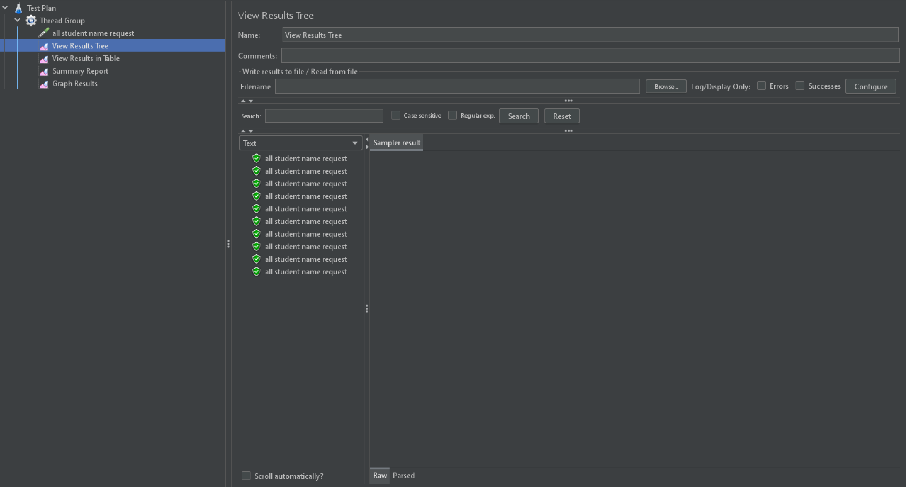
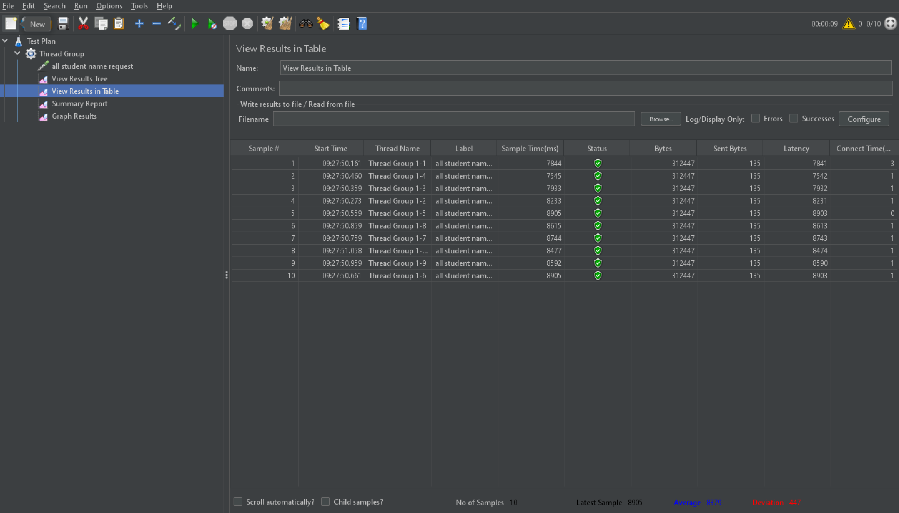
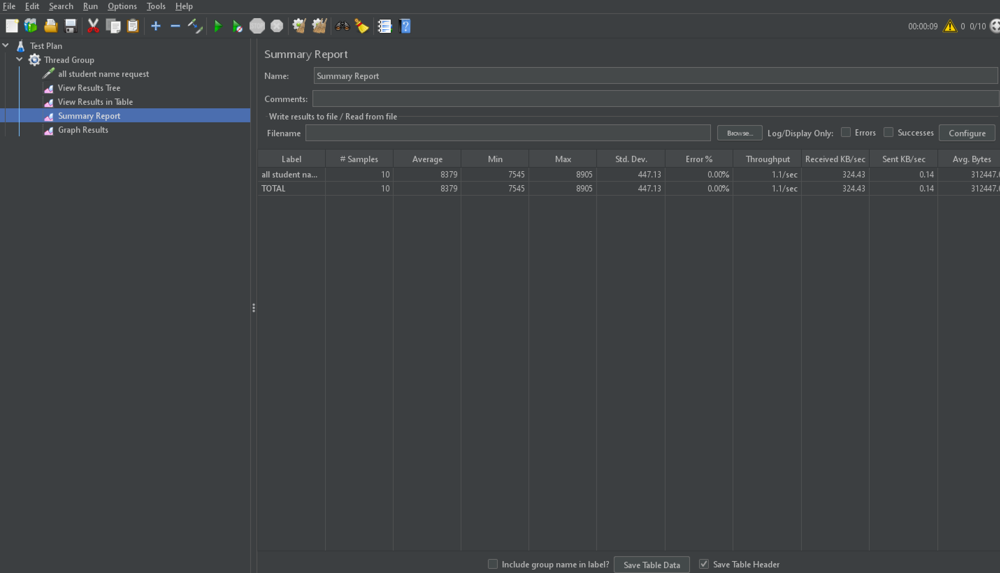
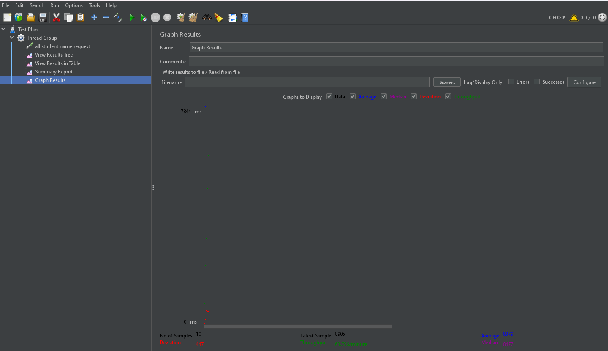
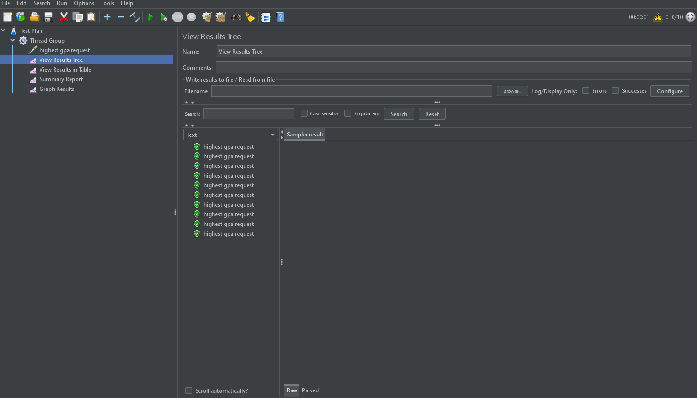
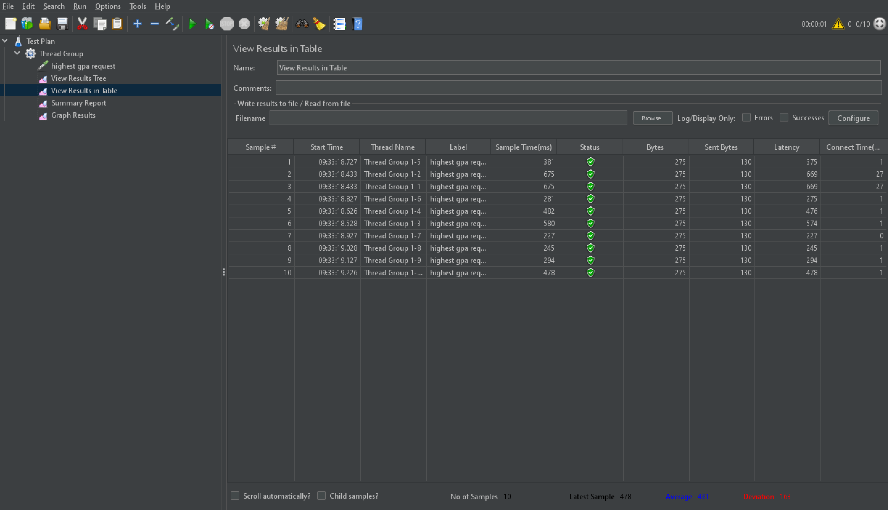
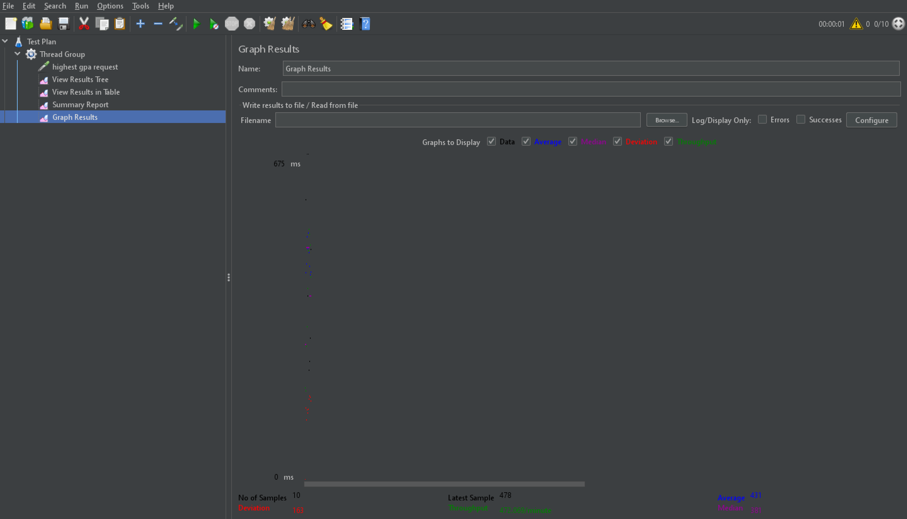

# Performance Profiling Report

- **Name**: Andrew Devito Aryo
- **NPM**: 2306152494
- **Class**: Adpro-A

## Before Optimization

### Test Results (Via GUI)

#### /all-student-name
- **View Results Tree**
    
- **View Results Table**
    
- **Summary Report**
    
- **Graph Results**
    

#### /highest-gpa
- **View Results Tree**
    
- **View Results Table**
    
- **Summary Report**
    
- **Graph Results**
    

### Test Results (Via CLI)

#### /all-student-name
```sh
timeStamp,elapsed,label,responseCode,responseMessage,threadName,dataType,success,failureMessage,bytes,sentBytes,grpThreads,allThreads,URL,Latency,IdleTime,Connect
1741660686735,7438,all student name request,200,,Thread Group 1-5,text,true,,312447,132,10,10,http://localhost:8080/all-student-name,7424,0,2
1741660686431,7742,all student name request,200,,Thread Group 1-2,text,true,,312447,132,10,10,http://localhost:8080/all-student-name,7732,0,20
1741660687027,7146,all student name request,200,,Thread Group 1-8,text,true,,312447,132,10,10,http://localhost:8080/all-student-name,7143,0,1
1741660686530,7643,all student name request,200,,Thread Group 1-3,text,true,,312447,132,10,10,http://localhost:8080/all-student-name,7629,0,2
1741660687127,7046,all student name request,200,,Thread Group 1-9,text,true,,312447,132,10,10,http://localhost:8080/all-student-name,7032,0,1
1741660686628,7545,all student name request,200,,Thread Group 1-4,text,true,,312447,132,10,10,http://localhost:8080/all-student-name,7532,0,1
1741660686828,7352,all student name request,200,,Thread Group 1-6,text,true,,312447,132,4,4,http://localhost:8080/all-student-name,7350,0,1
1741660686430,7763,all student name request,200,,Thread Group 1-1,text,true,,312447,132,3,3,http://localhost:8080/all-student-name,7761,0,21
1741660687227,6967,all student name request,200,,Thread Group 1-10,text,true,,312447,132,2,2,http://localhost:8080/all-student-name,6966,0,1
1741660686928,7284,all student name request,200,,Thread Group 1-7,text,true,,312447,132,1,1,http://localhost:8080/all-student-name,7281,0,1
```

#### /highest-gpa
```sh
timeStamp,elapsed,label,responseCode,responseMessage,threadName,dataType,success,failureMessage,bytes,sentBytes,grpThreads,allThreads,URL,Latency,IdleTime,Connect
1741660833815,131,highest gpa request,200,,Thread Group 1-1,text,true,,275,127,3,3,http://localhost:8080/highest-gpa,127,0,30
1741660833815,131,highest gpa request,200,,Thread Group 1-2,text,true,,275,127,3,3,http://localhost:8080/highest-gpa,128,0,30
1741660833906,87,highest gpa request,200,,Thread Group 1-3,text,true,,275,127,1,1,http://localhost:8080/highest-gpa,87,0,0
1741660834007,83,highest gpa request,200,,Thread Group 1-4,text,true,,275,127,1,1,http://localhost:8080/highest-gpa,83,0,1
1741660834105,95,highest gpa request,200,,Thread Group 1-5,text,true,,275,127,1,1,http://localhost:8080/highest-gpa,95,0,1
1741660834206,135,highest gpa request,200,,Thread Group 1-6,text,true,,275,127,2,2,http://localhost:8080/highest-gpa,134,0,1
1741660834311,94,highest gpa request,200,,Thread Group 1-7,text,true,,275,127,1,1,http://localhost:8080/highest-gpa,94,0,1
1741660834409,85,highest gpa request,200,,Thread Group 1-8,text,true,,275,127,1,1,http://localhost:8080/highest-gpa,85,0,1
1741660834520,82,highest gpa request,200,,Thread Group 1-9,text,true,,275,127,1,1,http://localhost:8080/highest-gpa,82,0,1
1741660834611,104,highest gpa request,200,,Thread Group 1-10,text,true,,275,127,1,1,http://localhost:8080/highest-gpa,104,0,0
```

## After Optimization

### Test Results (Via CLI)

#### /all-student-name
```sh
timeStamp,elapsed,label,responseCode,responseMessage,threadName,dataType,success,failureMessage,bytes,sentBytes,grpThreads,allThreads,URL,Latency,IdleTime,Connect
1741665464403,126,all student name request,200,,Thread Group 1-1,text,true,,312447,132,2,2,http://localhost:8080/all-student-name,122,0,13
1741665464440,97,all student name request,200,,Thread Group 1-2,text,true,,312447,132,1,1,http://localhost:8080/all-student-name,95,0,1
1741665464540,83,all student name request,200,,Thread Group 1-3,text,true,,312447,132,1,1,http://localhost:8080/all-student-name,82,0,0
1741665464640,85,all student name request,200,,Thread Group 1-4,text,true,,312447,132,1,1,http://localhost:8080/all-student-name,84,0,0
1741665464738,97,all student name request,200,,Thread Group 1-5,text,true,,312447,132,1,1,http://localhost:8080/all-student-name,96,0,1
1741665464838,109,all student name request,200,,Thread Group 1-6,text,true,,312447,132,2,2,http://localhost:8080/all-student-name,108,0,1
1741665464938,92,all student name request,200,,Thread Group 1-7,text,true,,312447,132,1,1,http://localhost:8080/all-student-name,91,0,1
1741665465039,101,all student name request,200,,Thread Group 1-8,text,true,,312447,132,2,2,http://localhost:8080/all-student-name,100,0,1
1741665465138,96,all student name request,200,,Thread Group 1-9,text,true,,312447,132,1,1,http://localhost:8080/all-student-name,95,0,0
1741665465237,88,all student name request,200,,Thread Group 1-10,text,true,,312447,132,1,1,http://localhost:8080/all-student-name,86,0,1
```

#### /highest-gpa
```sh
timeStamp,elapsed,label,responseCode,responseMessage,threadName,dataType,success,failureMessage,bytes,sentBytes,grpThreads,allThreads,URL,Latency,IdleTime,Connect
1741666636267,138,highest gpa request,200,,Thread Group 1-1,text,true,,275,127,3,3,http://localhost:8080/highest-gpa,133,0,14
1741666636302,109,highest gpa request,200,,Thread Group 1-2,text,true,,275,127,2,2,http://localhost:8080/highest-gpa,109,0,1
1741666636402,81,highest gpa request,200,,Thread Group 1-3,text,true,,275,127,1,1,http://localhost:8080/highest-gpa,81,0,0
1741666636501,80,highest gpa request,200,,Thread Group 1-4,text,true,,275,127,1,1,http://localhost:8080/highest-gpa,80,0,1
1741666636602,95,highest gpa request,200,,Thread Group 1-5,text,true,,275,127,1,1,http://localhost:8080/highest-gpa,95,0,1
1741666636700,87,highest gpa request,200,,Thread Group 1-6,text,true,,275,127,1,1,http://localhost:8080/highest-gpa,87,0,1
1741666636801,103,highest gpa request,200,,Thread Group 1-7,text,true,,275,127,2,2,http://localhost:8080/highest-gpa,103,0,1
1741666636899,81,highest gpa request,200,,Thread Group 1-8,text,true,,275,127,1,1,http://localhost:8080/highest-gpa,81,0,1
1741666636999,100,highest gpa request,200,,Thread Group 1-9,text,true,,275,127,2,2,http://localhost:8080/highest-gpa,100,0,0
1741666637098,89,highest gpa request,200,,Thread Group 1-10,text,true,,275,127,1,1,http://localhost:8080/highest-gpa,89,0,1
```

# Conclusion
After optimization, the profiling elapsed time is significantly faster. This improvement demonstrates the effectiveness of the optimizations applied, resulting in better performance and efficiency of the application.

# Reflection

### What is the difference between the approach of performance testing with JMeter and profiling with IntelliJ Profiler in the context of optimizing application performance?
Performance testing with JMeter focuses on simulating user load and measuring the application's response times, throughput, and error rates under various conditions. It helps identify performance issues from an end-user perspective. Profiling with IntelliJ Profiler, on the other hand, involves analyzing the application's internal behavior, such as CPU usage, memory allocation, and method execution times, to pinpoint specific code-level bottlenecks.

### How does the profiling process help you in identifying and understanding the weak points in your application?
Profiling provides detailed insights into the application's runtime behavior, allowing you to identify inefficient code paths, memory leaks, and resource-intensive operations. By examining the profiling data, you can understand which parts of the code are consuming the most resources and causing performance degradation.

### Do you think IntelliJ Profiler is effective in assisting you to analyze and identify bottlenecks in your application code?
Yes, IntelliJ Profiler is effective in analyzing and identifying bottlenecks. It offers a comprehensive set of tools to visualize and measure various performance metrics, making it easier to locate and address performance issues at the code level.

### What are the main challenges you face when conducting performance testing and profiling, and how do you overcome these challenges?
The main challenges include setting up realistic test scenarios, interpreting complex profiling data, and ensuring that optimizations do not introduce new issues. To overcome these challenges, I use a combination of automated testing tools, detailed documentation, and iterative testing to validate changes and maintain application stability.

### What are the main benefits you gain from using IntelliJ Profiler for profiling your application code?
The main benefits include the ability to identify and fix performance bottlenecks, optimize resource usage, and improve overall application efficiency. IntelliJ Profiler's integration with the development environment also streamlines the profiling process, making it more accessible and easier to use.

### How do you handle situations where the results from profiling with IntelliJ Profiler are not entirely consistent with findings from performance testing using JMeter?
In such situations, I cross-verify the results by running additional tests and analyzing the discrepancies. I also consider environmental factors, such as differences in test setups and data sets, that might affect the results. Collaborating with team members and using multiple profiling tools can also help in gaining a more accurate understanding of the performance issues.

### What strategies do you implement in optimizing application code after analyzing results from performance testing and profiling? How do you ensure the changes you make do not affect the application's functionality?
I prioritize optimizations based on their impact on performance and ease of implementation. Common strategies include optimizing algorithms, reducing memory usage, and improving concurrency. To ensure changes do not affect functionality, I use comprehensive unit and integration tests, along with continuous integration practices, to validate the application's behavior after each optimization.
